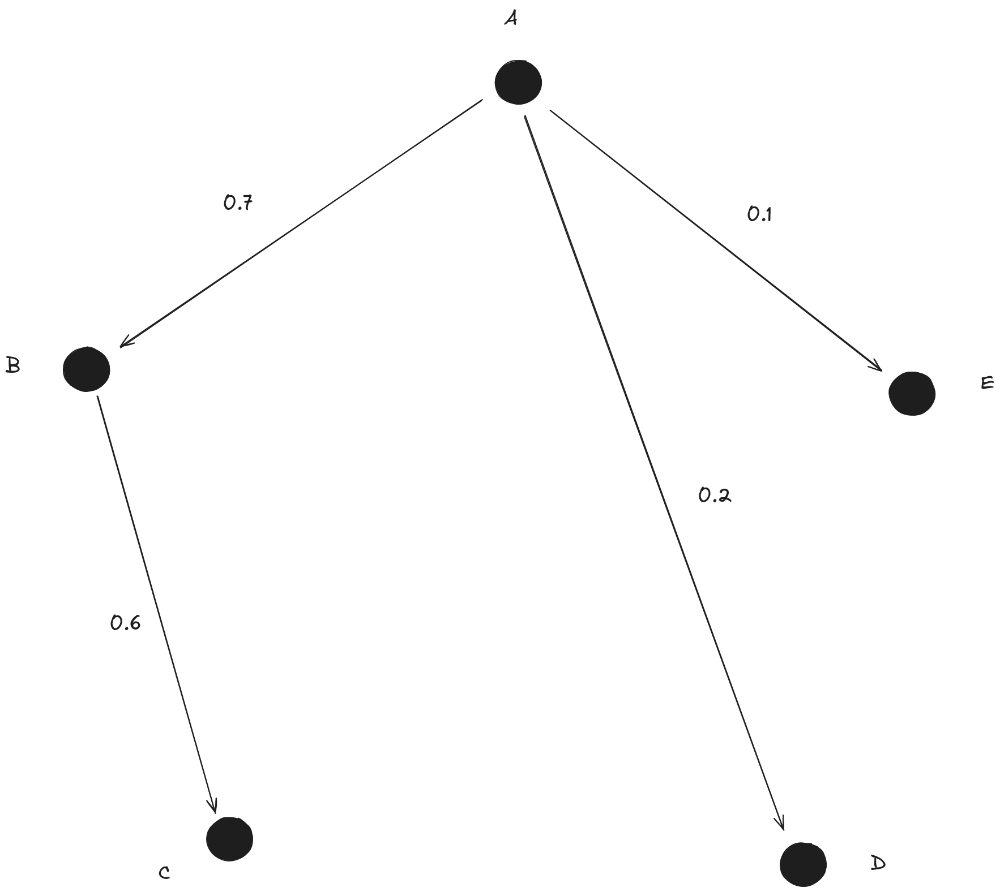

# The Rupture Propagation Problem

We often get a bunch of faults that we know participated in a rupture. Here is an example for the Darfield quake.


(Here each colour represents a different fault.)

We might know the hypocentre, or this might be a rupture from the NSHM where we don't know the hypocentre. The problem is **ruptures don't start simultaneously**; they trigger each other in specific orders. In fact, there are lots of possible orders.

Here's one:


And another:


And one more for luck:


The red arrows make up what's called the rupture propagation tree.

If you're thinking to yourself, "that last one seems a bit silly," you're right! It's totally unphysical. It turns out that the probability of jumping between two given faults is related to their distance from each other. Using this probability, you can derive the probability of a whole rupture tree. Essentially, the rupture propagation problem is two problems:

1. If we know a hypocentre, we want to fairly (according to the probability of each rupture tree) sample possible rupture propagation trees starting from the fault containing the hypocentre.
2. If we don't know the hypocentre (as in the case of NSHM, or perhaps if you wanted to rerun Darfield with the same faults but different rupture scenarios), we want to sample the rupture trees fairly over every possible initial fault.

# The Rupture Propagation Model

The rupture propagation model simulates the probability of different rupture trees by modelling ruptures using graphs. Specifically, every fault/source becomes a node, and the edge weights are probabilities that the rupture could jump between nodes. If we assume that rupture jumps are independent, and allow for a moment that the same fault could be triggered twice, we can draw random numbers for each edge to obtain different subgraphs.


In the above example, we constructed a graph out of five sources, assigned probabilities of rupture jumping between them according to some measure (in our code, we use distance), and then drew a random subgraph $H$. The probability of sampling $H$ is the product of the edge weights it includes, multiplied by $1 -$ the edge weights we didn't include: $0.7 \times 0.1 \times 0.6 \times 0.3 \times (1 - 0.2) = 0.01008$. In general, if $w(e)$ is the edge weight of the edge $e$ in a subgraph $H$, then:

$$
P(H) = \prod_{e \in H} w(e) \prod_{e \notin H} (1 - w(e))
$$

Looking again at our example subgraph $H$, we can see that $H$ cannot possibly be a rupture propagation scenario for two reasons:

1. There is a cycle in $H$, which would mean that some source would have to be triggered twice. Because a source cannot be triggered twice, we require $H$ to be acyclic to be a valid rupture propagation scenario.
2. One of the sources is never triggered. This is not physically impossible (indeed, it's highly likely), but we want to assume that every source is triggered. Therefore, we need $H$ to be a spanning tree.

To fairly sample rupture propagation trees, we calculate the **conditional probability** $P(T | T \text{ is a spanning tree of } G)$, which is given by the formula:

$$
P(T | T \text{ is a spanning tree of } G) = \frac{P(T)}{\sum_{T^\prime \text{ is a spanning tree of } G} P(T^\prime)}
$$

For realistic scenarios, including the Darfield earthquake, there are thousands or tens of thousands of spanning trees, but most have a trivial probability. We want to sample these spanning trees according to their conditional probability **without** generating every single one.

## Handling the Initial Fault

The initial fault could be known, unknown, or determined according to a prior distribution over the nodes. To account for this, we independently select one of the sources to be the initial fault after selecting a spanning tree. Selecting an initial fault and tree completely determines the **rupture propagation tree**, which is defined as a spanning tree with directed edges indicating the direction of rupture propagation. For example, in the graph $H$, if we label the nodes $A$ through $E$ and select $A$ as the initial source, we get the following rupture propagation tree:



## A Toy Example

To get a feel for this problem, let’s create a simple example with three point sources. Assume we have three point sources $A$, $B$, and $C$, and the probability of a rupture jumping between $A$ and $B$ is $80\%$, between $B$ and $C$ is $90\%$, and between $A$ and $C$ is $30\%$. Ignoring the direction for a moment, there are three possible rupture trees $T_1$, $T_2$, and $T_3$, each with different probabilities:


The conditional probabilities for $T_1$, $T_2$, and $T_3$ are roughly $0.18$, $0.73$, and $0.08$, respectively. If we generate 100 realisations for these three sources, we should expect $T_1$ in 18-19 cases, $T_2$ in 73–74 cases, and $T_3$ in 8–9 cases.

## The Sampling Algorithm

We can only efficiently sample spanning trees proportional to their **weight**, which is defined as the product of edge weights in the tree. The probability distribution we obtain is:

$$
P_w(T) = \frac{\prod_{e \in T} w(e)}{\sum_{T^\prime} \prod_{e \in T^\prime} w(e)}
$$

At first glance, $P_w(T)$ looks identical to $P(T)$, but alas, it isn’t. Instead, it over-represents unlikely rupture scenarios! The intuition here is that $P_w(T)$ doesn't account edge weights not included in $T$, and so doesn't penalise $T$ for skipping extremely likely jumps[^1]. In the toy example above, the probabilities for $T_1$, $T_2$, and $T_3$ become roughly $0.22$, $0.59$, and $0.20$, respectively. You can see that $T_3$ would be oversampled in 100 realisations relative to its true probability. To make this work, we construct a different graph $G^\prime$, where the edge weights are adjusted as:

[^1]: More formally, $P_w(T)$ is the probability that a subgraph contains the edges of $T$, which is different to saying that a subgraph is exactly $T$. This measure might be useful in some other contexts.

$$
w_{G^\prime}(e) = \frac{w_G(e)}{1 - w_G(e)}.
$$

Doing so ensures that:

$$
\prod_{e \in T} w_{G^\prime}(e) \prod_{e \in G} (1 - w_G(e)) = \prod_{e \in T} w_G(e) \prod_{e \notin T} (1 - w_G(e)) = P(T).
$$

The term $\prod_{e \in G} (1 - w_G(e))$ is constant for all trees (since it considers every edge of $G$, regardless of $T$). Thus:

$$
\prod_{e \in T} w_{G^\prime}(e) \propto P(T).
$$

Now sampling according to the product of weights in $G^\prime$ is equivalent to sampling spanning trees according to their probability! To implement this, we leverage `networkx.random_spanning_tree` ([docs](https://networkx.org/documentation/stable/reference/algorithms/generated/networkx.algorithms.tree.mst.random_spanning_tree.html)).

## Selecting Ruptures by Threshold

Suppose that, instead of knowing how many ruptures you want, you want a list of ruptures that represent at least a fixed probability of the total distribution. More formally, given a probability threshold $0 \leq p_{\text{thresh}} \leq 1$, you want the smallest set of trees $\tau$ such that:

$$
\sum_{T \in \tau} P(T \mid T \text{ is a spanning tree of } G) \geq p_{\text{thresh}}.
$$

To achieve this, we collect a list of spanning trees ordered from highest to lowest probability and stop when their cumulative probability meets or exceeds the threshold. Conceptually, the algorithm looks like this:

```python
total_probability_of_spanning_trees = sum(probability(tree) for tree in spanning_trees)
# NOTE: we don’t calculate the total probability like this!
# We use a smarter method that avoids computing all trees.
for tree in spanning_trees_ordered_by_probability(G):
    sample.append(tree)
    sample_probability += probability(tree) / total_probability_of_spanning_trees  # P(T | T is a spanning tree of G)
    if sample_probability >= threshold:
        break
return sample
```

In the toy example, if $p_{\text{thresh}} = 0.5$, we should just get $T_2$, but if $p_{\text{thresh}} = 0.9$, we should get both $T_2$ and $T_1$.

### Using NetworkX to Order Spanning Trees

NetworkX includes the `SpanningTreeIterator` class ([docs](https://networkx.org/documentation/stable/reference/algorithms/generated/networkx.algorithms.tree.mst.SpanningTreeIterator.html#networkx.algorithms.tree.mst.SpanningTreeIterator)), which allows us to:

> Iterate over all spanning trees of a graph in either increasing or decreasing cost.

However, NetworkX defines **cost** as the sum of edge weights. To align the minimum spanning tree definition of cost with the product definition of tree probability, we can use logarithms. Specifically, we create a graph $G^{\prime\prime}$ with edge weights defined as:

$$
w_{G^{\prime\prime}}(e) = \log\left(\frac{w_G(e)}{1 - w_G(e)}\right).
$$

This transformation ensures that iterating over the graphs in descending order of summed cost in $G^{\prime\prime}$ is equivalent to iterating in descending order of probability.

### Total Probability via the Matrix-Tree Theorem

To check when the cumulative probability of selected spanning trees meets the threshold $p_{\text{thresh}}$, we need the total probability of all spanning trees. Calculating this directly by enumerating all trees is computationally expensive. Instead, we use the [Matrix-Tree theorem](https://en.wikipedia.org/wiki/Kirchhoff%27s_theorem), which computes the total probability using the determinant of a special matrix. NetworkX implements this as `nx.number_of_spanning_trees` ([docs](https://networkx.org/documentation/stable/reference/algorithms/generated/networkx.algorithms.tree.mst.number_of_spanning_trees.html)).


## Examples Applied to the Darfield Rupture Scenario

Atzori (2010) defines the rupture geometry for the Darfield earthquake as consisting of 8 segments. Below is a map of the segments:


The hypocentre for this event was located on the fault circled in red. For these 8 segments, there are **8575 spanning trees**. The real rupture path taken in 2010 corresponds to one of these spanning trees, but we do not know which one. Instead, we must fairly sample the spanning trees based on their probabilities using the new rupture propagation sampling algorithm.

### Cumulative Probability Distribution

By cumulatively summing the spanning tree probabilities, we can construct the cumulative distribution function (CDF) for $P(\text{Top N Spanning Trees})$. Here is the resulting distribution:


This type of distribution is typical: only the first 10 or so rupture scenarios have non-trivial probabilities, while the remaining scenarios involve such improbable rupture jumps that they are not worth simulating. Among these, three rupture scenarios dominate, accounting for the majority of the probability mass.

### Most Likely Rupture Scenarios

1. **Top Scenario**
   Probability: **28%**
   Visualisation:
   

2. **Second Most Likely Scenario**
   Probability: **27%**
   Visualisation:
   

3. **Third Most Likely Scenario**
   Probability: **25%**
   Visualisation:
   

4. **Fourth Most Likely Scenario**
   Probability: **2%**
   Visualisation:
   

### Summary

The top three rupture scenarios account for approximately **80% of the total probability mass**, making them the most plausible candidates for simulation. The remaining spanning trees, although numerous, contribute negligibly to the total probability distribution and can probably be disregarded in practical applications.
